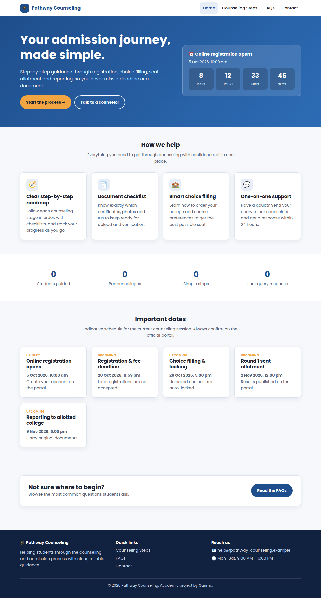
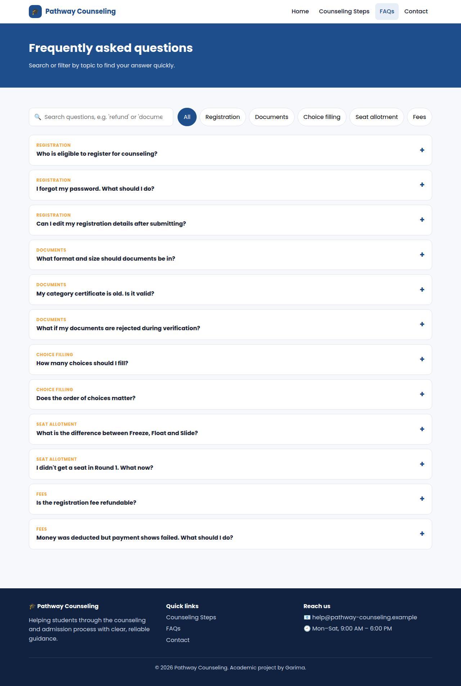
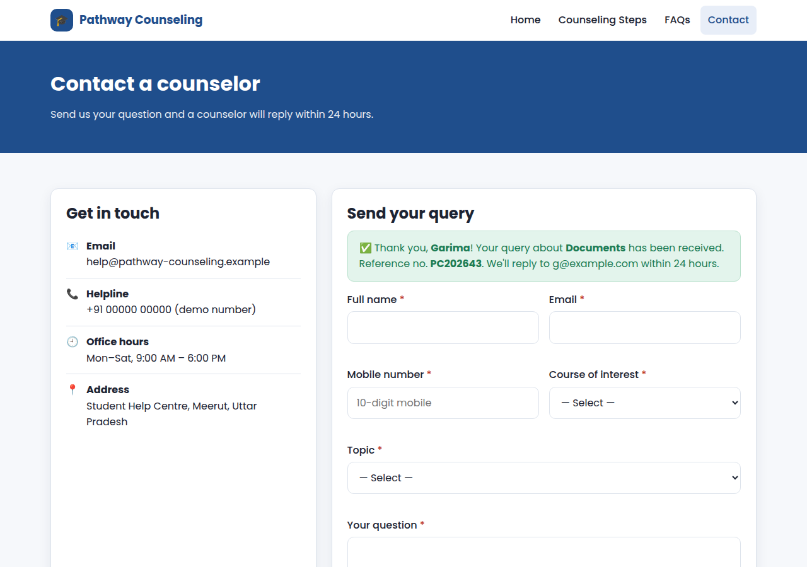
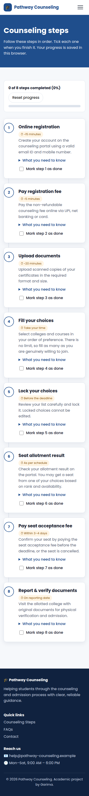

# Counseling System (Website)

A responsive, multi-page website that guides students through the **college counseling and admission process**, from registration to reporting at the allotted college.
It is built with **semantic HTML5, CSS3 (Flexbox and Grid) and vanilla JavaScript**, with no frameworks.



## Pages

| Page | Highlights |
|---|---|
| **Home** (`index.html`) | Hero section, a **live countdown** to the next deadline, an important-dates timeline that marks each date *Completed / Up next / Upcoming* automatically, and animated statistics |
| **Counseling Steps** (`steps.html`) | An 8-step roadmap (registration → fee → documents → choice filling → locking → allotment → seat acceptance → reporting). Each step has an expandable checklist, and a **progress tracker** is saved in the browser |
| **FAQs** (`faqs.html`) | Accessible accordion with **live search** (matches are highlighted) and **category filter chips** |
| **Contact** (`contact.html`) | Query form with **real-time JavaScript validation**: name, email, 10-digit Indian mobile number, dropdowns, and a minimum message length with a character counter. Shows a confirmation with a reference number |

## Features
* **Mobile-first responsive layout** using CSS Grid and Flexbox, with a hamburger menu on small screens
* **Semantic, accessible markup**: `header/nav/main/section/article/aside/footer`, skip link, `aria-expanded` / `aria-current` / `aria-live`, visible focus styles, and support for reduced motion
* **Dynamic content**: steps, FAQs and dates are rendered from `js/data.js`, so content can be updated without editing HTML
* Works in all modern browsers (Chrome, Edge, Firefox, Safari)

## Project structure
```
counseling-system/
├── index.html        # Home
├── steps.html        # Counseling Steps
├── faqs.html         # FAQs
├── contact.html      # Contact form
├── css/style.css     # All styles (CSS variables, Grid/Flexbox, media queries)
├── js/data.js        # Steps, FAQs and important dates (content)
├── js/main.js        # Navigation, countdown, progress tracker, FAQ search, form validation
└── screenshots/
```

## Run locally
There's no build step. Open `index.html` in a browser, or serve the folder:
```bash
python -m http.server 8000     # then visit http://localhost:8000
```

## Deploy on GitHub Pages
In the repo, go to **Settings → Pages**, set Source to *Deploy from a branch*, and choose Branch `main` and folder `/ (root)`.
The site will go live at `https://<your-username>.github.io/counseling-system/`.

## Screenshots
| FAQs (search & filter) | Contact form validation | Steps (mobile) |
|---|---|---|
|  |  |  |

## Tech stack
HTML5 · CSS3 (Flexbox, Grid, custom properties) · JavaScript (ES6+) · VS Code · Git/GitHub

> The contact form is front-end only (academic project). Submitted queries are kept in the browser's localStorage in place of a backend.
